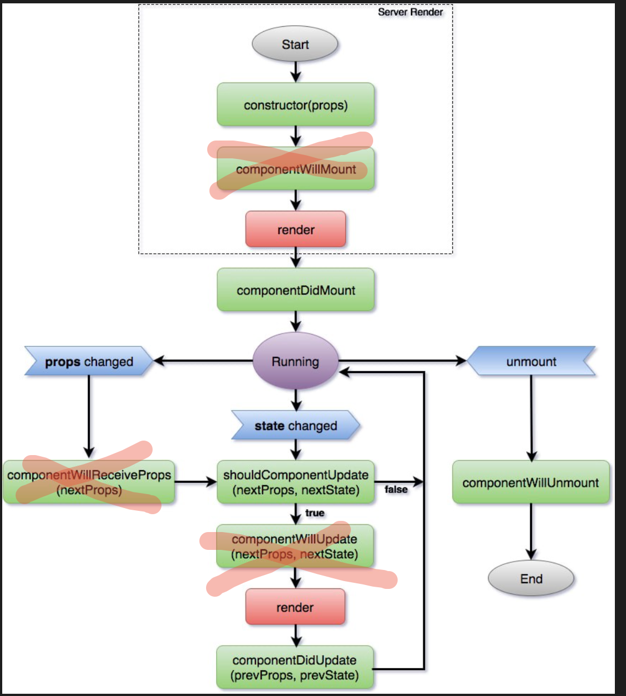

# React Component Lifecycle

## Flowchart

### React < v16

## React > v17

## Ref:

1. https://levelup.gitconnected.com/componentdidmakesense-react-lifecycle-explanation-393dcb19e459

2. https://ultimatecourses.com/blog/using-async-await-inside-react-use-effect-hook
